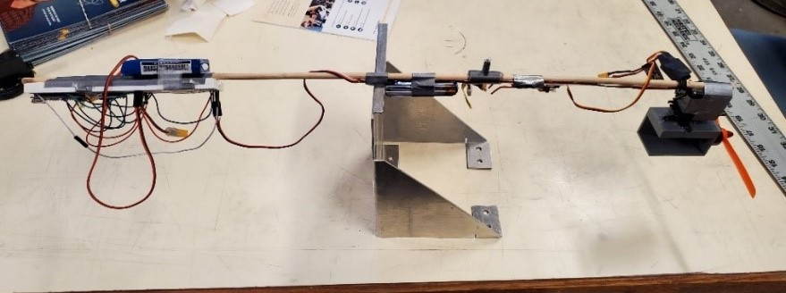
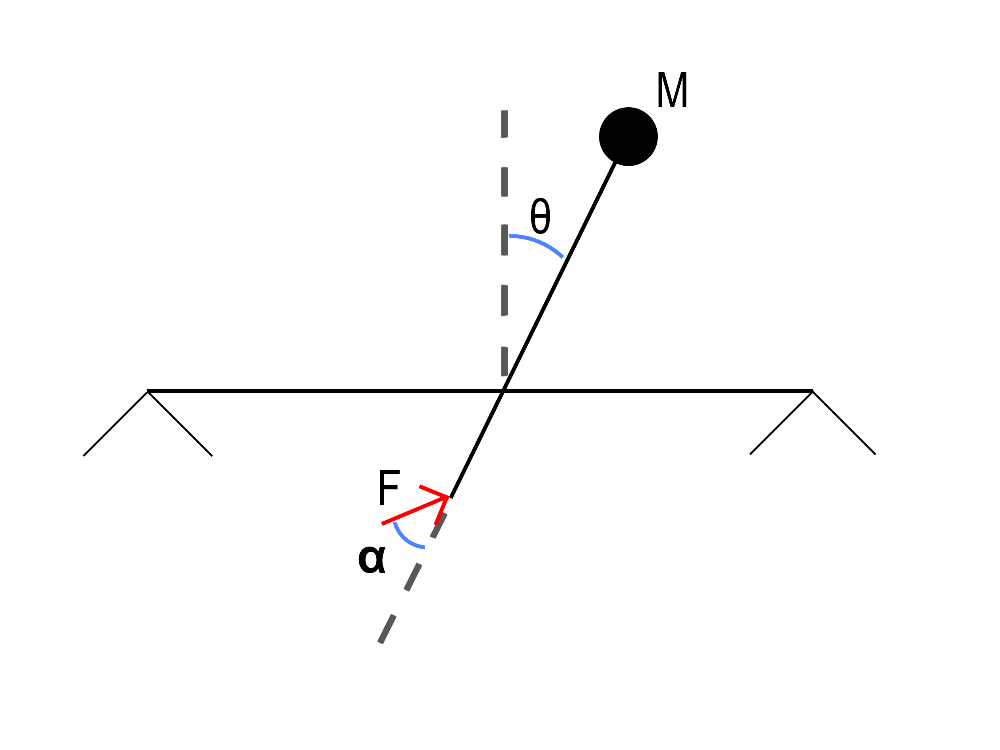
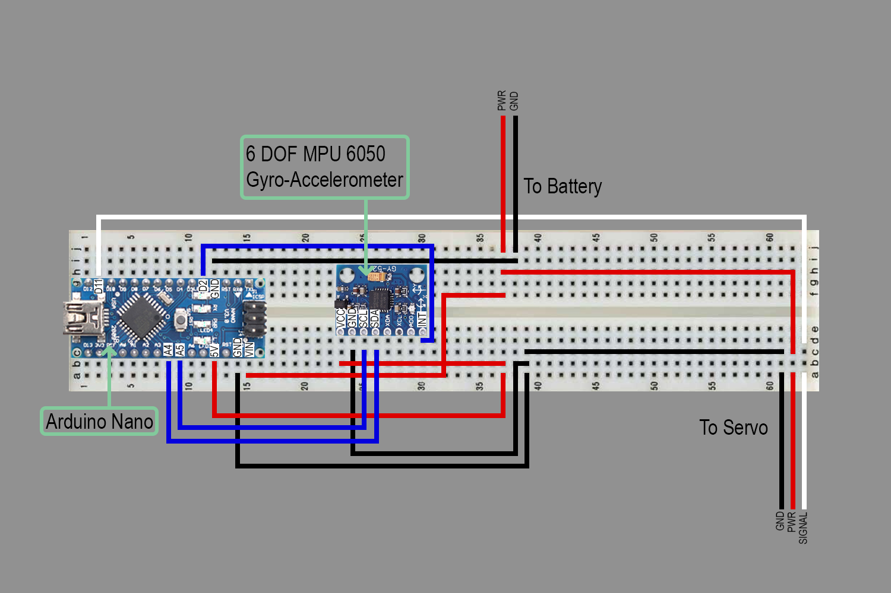
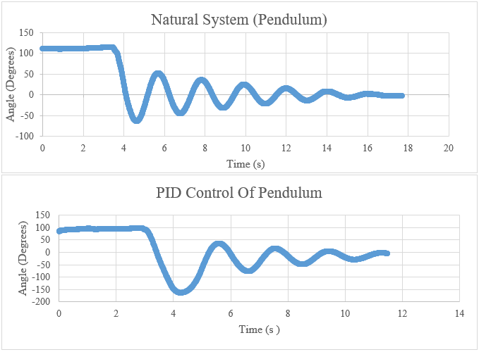
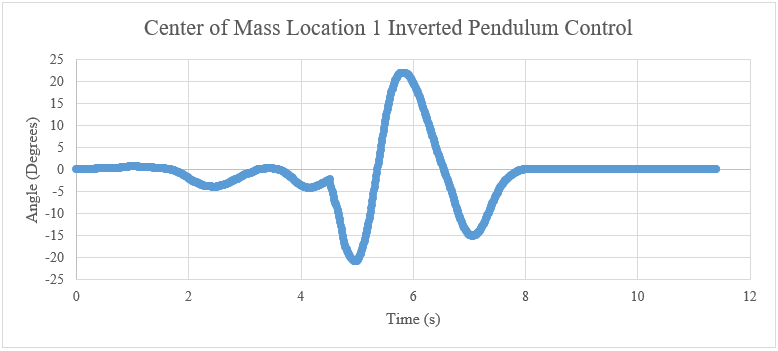
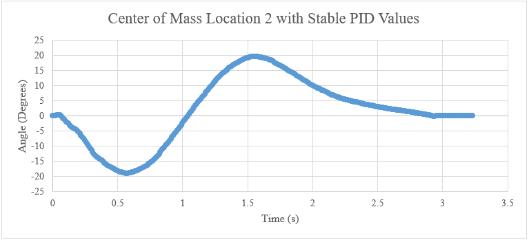

# Thrust Vector Control

Thrust vectored inverted pendulum stabilized via PID controller ([Video](https://www.youtube.com/watch?v=4QJYorsHh1g)).

## Authors

- [Jonathan Cochran](https://github.com/ionzzu)
- Bryson Jaipean
- Cameron Retzlaff

## Background

- Thrust vector control is often used to steer an aircraft or rocket by adjusting the direction of thrust
- This project forms a basis for a control model for a thrust vectored rocket

## Goals

- Adjust angle of thrust to keep inverted pendulum upright
- Gather initial controller feedback for a thrust vectored rocket
- Evaluate performance of PID control system

## System Design

- System consumes rotation angle with an analog input from a gyroscope
- Positional servo adjusts angle of thrust, manipulating the torque about the point of rotation
- Thrust force generated via Brushless RC Motor connected to a RC Plane Propeller
    - Motor throttled by electronic speed controller with a wireless RC transmitter
- PID control and feedback powered by Arduino Nano
    - Enabled constant adjustment to thrust force angle
- Parts mounted to a wooden dowel
- Inverted pendulum affect created by ensuring the end opposite the propeller weighted higher than propeller end
- Moment of inertia calculated from distance between center of mass and rotation point
- Breadboard position adjusted to create multiple test cases of differing center of mass

#### Pendulum Balancing

#### Free-body Diagram

Torque applied about point of rotation from thrust force F at angle α, modifying pendulum rotation angle θ

#### Wiring Diagram

## PID Controller

- A PID (Proportional-Integral-Derivative) controller is a feedback control loop
- Enables constant modulated control of a system

### Stable System

- Tested for ultimate proportional gain and ultimate period of a regular pendulum
- Determined Zeigler Nichols PID values for naturally stable system
- Implemented PID values to control stable system
- PID system returned 5 second stabilization improvement over natural system at 110 degree displacement

#### Natural System vs. PID Controlled System

### Inverted System

- Ziegler-Nichols method PID values not sufficient for inverted system
- Evaluated divergence time to determine to validate Pessen Integral PID values
- Tuned PID values by experimentally adjusting Pessen Integral PID values
- Implemented +/- 2 degree deadband at center to avoid PID accumulating error
- Evaluated system control with two center of mass locations
    - Location 1: 4in from center of rotation
    - Location 2: 4.5in from center of rotation

#### Stable System Configuration 1

#### Stable System Configuration 2

### Key learnings

- Proportional value proportionally connected to the moment of inertia of the system
- Integral value is inversely proportional to moment of inertia of the system
- Derivative term not impacted by the moment of inertia of the system